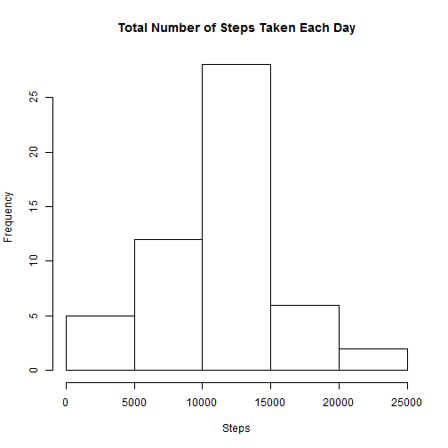
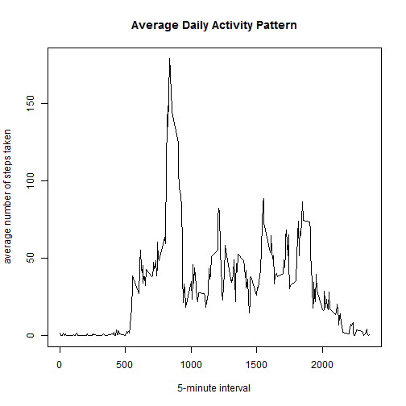
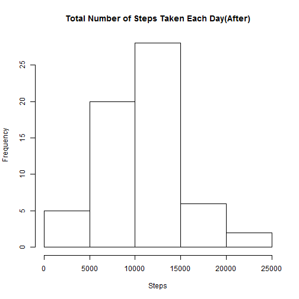
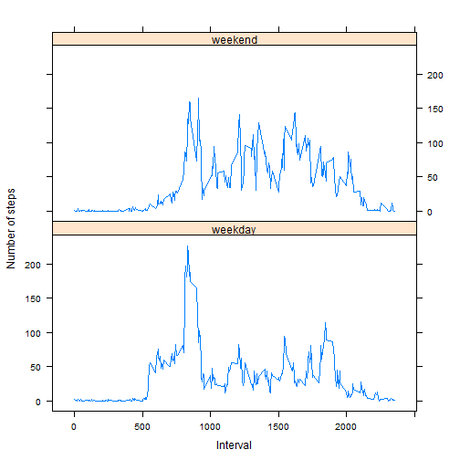

## Part1 Loading and preprocessing the data

```r
dat<-read.csv("activity.csv")
Sys.setlocale("LC_TIME", "English")
```

```
## [1] "English_United States.1252"
```

```r
dat$date<-as.Date(dat$date,format="%Y-%m-%d")
```

## Part2 The Mean & Median of Total Number of Steps Taken per Day
Below is a histogram of the total number of steps taken each day.  

```r
dat2<-aggregate(steps~date,data=dat,FUN="sum")
hist(dat2$steps,main="Total Number of Steps Taken Each Day",xlab="Steps")
```

 

```r
mean<-mean(dat2$steps,na.rm=T)
median<-median(dat2$steps,na.rm=T)
```
The mean of total number of steps taken per day is 1.0766 &times; 10<sup>4</sup>.

The median of total number of steps taken per day is 10765.

## Part3 The Average Daily Activity Pattern
Below is a time series plot of the 5-minute interval (x-axis)
and the average number of steps taken, averaged across all days (y-axis)

```r
dat3<-aggregate(steps~interval,data=dat,FUN="sum")
days<-unique(dat$date)
dat3$steps<-dat3$steps/length(days)
plot(dat3$interval,dat3$steps,main="Average Daily Activity Pattern",
     xlab="5-minute interval",ylab="average number of steps taken",type="l")
```

 

```r
max<-dat3[dat3$steps==max(dat3$steps),1]
```
The 5-minute interval number 835 , on average across all the days in the dataset,contains the maximum number of steps?

## Part4 Imputing Missing Values

```r
list1<-is.na(dat[,1])
n_NA<-sum(list1)
```
The total number of missing values in the dataset is 2304

To fill all the missing values in the dataset, I use the following strategy :  
replace all the missing values with the mean of that 5-minute interval

```r
dat4<-dat
l<-nrow(dat)
for (i in 1:l){
    if (is.na(dat[i,1])){
        dat4[i,1]<-dat3[dat3$interval==dat[i,3],2]
    }
}
dat5<-aggregate(steps~date,data=dat4,FUN="sum")
hist(dat5$steps,main="Total Number of Steps Taken Each Day(After)",xlab="Steps")
```

 

With the new dataset with the missing data filled in, we can notice:

```r
mean2<-mean(dat5$steps,na.rm=T)
median2<-median(dat5$steps,na.rm=T)
delta<-abs(mean2-mean)/mean
delta2<-abs(median2-median)/median
```
The new mean of total number of steps taken per day is 1.0581 &times; 10<sup>4</sup>.   
The new median of total number of steps taken per day is 1.0395 &times; 10<sup>4</sup>.   

The mean has changed by 0.0172 & the median has changed by 0.0344.

## Part5 Differences in Activity Patterns between Weekdays and Weekends
Create a new factor variable in the dataset with two levels ¨C ¡°weekday¡±
and ¡°weekend¡± indicating whether a given date is a weekday or weekend
day.

```r
dat4$dayofweek<-weekdays(dat4$date)
dat4$dayofweek[dat4$dayofweek=="Saturday"|dat4$dayofweek=="Sunday"]<-"weekend"
dat4$dayofweek[dat4$dayofweek!="weekend"]<-"weekday"
```
Below is a panel plot containing a time series plot (i.e. type = "l") of the
5-minute interval (x-axis) and the average number of steps taken, averaged
across all weekday days or weekend days (y-axis).

```r
library(lattice)
dat6<-aggregate(steps~interval+dayofweek,data=dat4,FUN="mean")
xyplot(steps~interval|dayofweek,data=dat6,type="l",ylab="Number of steps",xlab="Interval",layout=c(1,2))
```

 


During the weekday, there is a peak in activity early in the day, but in the rest of time, little or less activity.    
During the weekend, the activity is usually a bit higher than during the weekday.
